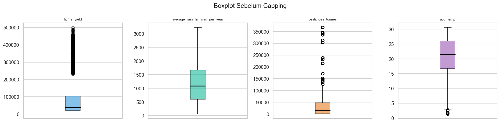
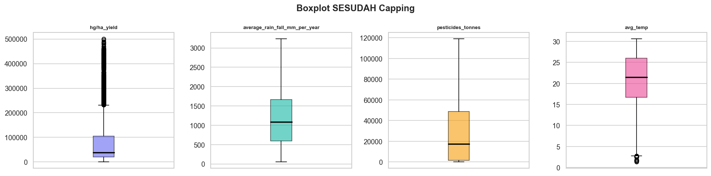

# LAPORAN TUGAS KELOMPOK
# Prediksi Hasil Panen Tanaman Berbasis Data Iklim dan Nutrisi Tanaman Menggunakan Random Forest

> **📌 Catatan Penggunaan Template:**
> - Teks dalam `[kurung siku]` = bagian yang harus diisi/dilengkapi kelompok
> - Teks dalam *miring* = panduan/instruksi, hapus sebelum submit
> - Batas similarity Turnitin: **< 20%** | Batas AI: **< 25%**
> - Parafrase semua bagian yang diambil dari referensi

---

## 📄 COVER

```
LAPORAN TUGAS KELOMPOK

PREDIKSI HASIL PANEN TANAMAN BERBASIS DATA IKLIM DAN NUTRISI TANAMAN
MENGGUNAKAN ALGORITMA RANDOM FOREST REGRESSOR

Mata Kuliah : Analisis dan Pengolahan Data Digital
Dosen       : [Nama Dosen]
Semester    : [Semester & Tahun Akademik]

Disusun Oleh:
Kelompok [Nomor Kelompok]

No. | Nama                   | NIM
----|------------------------|----------
 1  | [Nama Anggota 1]       | [NIM]
 2  | [Nama Anggota 2]       | [NIM]
 3  | [Nama Anggota 3]       | [NIM]
 4  | [Nama Anggota 4]       | [NIM]

PROGRAM STUDI [NAMA PRODI]
FAKULTAS [NAMA FAKULTAS]
UNIVERSITAS [NAMA UNIVERSITAS]
[TAHUN]
```

---

## 📋 DAFTAR ISI

```
Daftar Isi ................................................... i
Daftar Gambar ................................................ ii
Daftar Tabel ................................................. iii

BAB I   PENDAHULUAN
  1.1   Latar Belakang ........................................ 1
  1.2   Rumusan Masalah ....................................... 3
  1.3   Tujuan Penelitian ..................................... 3
  1.4   Batasan Masalah ....................................... 4
  1.5   Analisis Gap dengan Riset Sebelumnya .................. 4

BAB II  TINJAUAN PUSTAKA
  2.1   Kajian Teori .......................................... 6
    2.1.1  Hasil Panen dan Faktor Pengaruhnya ................. 6
    2.1.2  Data Mining dan Machine Learning ................... 7
    2.1.3  Random Forest Regressor ............................ 7
    2.1.4  Analisis Data Eksploratif (EDA) .................... 9
    2.1.5  Metode Preprocessing Data .......................... 10
  2.2   Literature Review ..................................... 11

BAB III ANALISIS DAN DESAIN
  3.1   Pengumpulan dan Pemrosesan Data ....................... 14
  3.2   Analisis Eksplorasi dan Statistik Dataset ............. 17
  3.3   Pemodelan Masalah ..................................... 21
  3.4   Analisis Kebutuhan Fungsional dan Non-Fungsional ...... 23
  3.5   Desain Sistem ......................................... 25
  3.6   Desain UI/UX .......................................... 32
  3.7   Perancangan Eksperimen ................................ 34
  3.8   Perancangan Evaluasi Model ............................ 35

DAFTAR PUSTAKA ................................................ 37
```

---

## BAB I — PENDAHULUAN

### 1.1 Latar Belakang

*[Tulis 3–5 paragraf. Gunakan pola: umum → spesifik → urgensi → solusi yang diusulkan. Parafrase dari referensi!]*

**Paragraf 1 — Konteks Global (Pertanian & Pangan)**

Ketahanan pangan merupakan salah satu isu strategis global yang terus mendapat perhatian dari berbagai negara di dunia. Meningkatnya jumlah penduduk dunia yang diperkirakan mencapai [~10 miliar jiwa pada tahun 2050] menuntut peningkatan produksi pertanian secara berkelanjutan [1]. Sektor pertanian memiliki peran vital dalam menyediakan kebutuhan pangan, namun juga sangat rentan terhadap perubahan kondisi lingkungan, terutama faktor iklim seperti curah hujan, suhu udara, dan penggunaan pupuk atau pestisida [2].

**Paragraf 2 — Permasalahan Spesifik (Prediksi Yield)**

Salah satu tantangan utama dalam manajemen pertanian modern adalah memprediksi hasil panen (*crop yield*) secara akurat. Hasil panen yang tidak terprediksi dengan baik dapat menyebabkan kerugian ekonomi yang signifikan, baik bagi petani maupun pemerintah dalam merumuskan kebijakan distribusi pangan. Faktor-faktor seperti jenis tanaman, negara asal, suhu rata-rata, curah hujan, dan penggunaan pestisida memiliki pengaruh yang kompleks dan nonlinear terhadap produktivitas pertanian [3].

**Paragraf 3 — Pemanfaatan Machine Learning**

Perkembangan teknologi kecerdasan buatan dan analisis data memberikan peluang baru dalam bidang pertanian presisi (*precision agriculture*). Pendekatan *machine learning* telah terbukti mampu menangkap pola kompleks dalam data pertanian yang tidak dapat ditangkap oleh model statistik konvensional [4]. Salah satu algoritma yang banyak digunakan dalam konteks prediksi nilai kontinu adalah **Random Forest Regressor**, yang dikenal memiliki akurasi tinggi, tahan terhadap overfitting, dan mampu menangani data dengan dimensi tinggi serta fitur kategorikal [5].

**Paragraf 4 — Dataset yang Digunakan**

Penelitian ini menggunakan dataset hasil panen global yang memuat informasi dari berbagai negara dan jenis komoditas pertanian. Dataset terdiri dari 28.242 rekaman data yang mencakup variabel iklim (curah hujan, suhu rata-rata), variabel pertanian (penggunaan pestisida), serta identitas geografis dan komoditas (negara dan jenis tanaman). Dengan memanfaatkan dataset ini, penelitian bertujuan membangun model prediktif yang dapat memperkirakan hasil panen dalam satuan hg/ha berdasarkan kombinasi faktor-faktor tersebut.

**Paragraf 5 — Urgensi dan Kontribusi**

Penelitian ini diharapkan dapat memberikan kontribusi dalam bentuk model prediksi hasil panen yang akurat, serta pemahaman mendalam mengenai faktor-faktor dominan yang memengaruhi produktivitas pertanian di berbagai wilayah. Selain itu, hasil penelitian dapat menjadi referensi bagi pengambil kebijakan dalam merencanakan strategi ketahanan pangan yang lebih efektif.

---

### 1.2 Rumusan Masalah

Berdasarkan latar belakang yang telah diuraikan, rumusan masalah dalam penelitian ini adalah:

1. Faktor iklim dan pertanian apa saja yang paling berpengaruh terhadap hasil panen tanaman?
2. Apakah terdapat hubungan yang signifikan antara variabel iklim dan pertanian dengan hasil panen (*yield*)?
3. Seberapa baik algoritma Random Forest Regressor dalam memprediksi hasil panen berdasarkan faktor-faktor tersebut?
4. Fitur mana yang memiliki kontribusi paling dominan dalam model prediksi?

---

### 1.3 Tujuan Penelitian

Adapun tujuan dari penelitian ini adalah:

1. Mengidentifikasi dan menganalisis faktor-faktor yang memengaruhi hasil panen tanaman berbasis data iklim dan pertanian.
2. Membangun model prediksi hasil panen menggunakan algoritma **Random Forest Regressor**.
3. Mengevaluasi performa model dengan metrik MAE, RMSE, dan R².
4. Menginterpretasikan hasil pemodelan untuk mendapatkan *insight* yang relevan dalam konteks pertanian.

---

### 1.4 Batasan Masalah

Penelitian ini memiliki batasan sebagai berikut:

1. Dataset yang digunakan terbatas pada data historis dalam file `yield_df.csv` yang mencakup informasi dari beberapa negara dan komoditas tanaman tertentu.
2. Model yang dibangun adalah model **regresi** (prediksi nilai kontinu), bukan klasifikasi.
3. Penelitian tidak mencakup deployment atau integrasi sistem ke lingkungan produksi.
4. Algoritma utama yang digunakan hanya **Random Forest Regressor**; perbandingan multi-algoritma tidak menjadi fokus utama.

---

### 1.5 Analisis Gap dengan Riset Sebelumnya

*[Bandingkan penelitian ini dengan minimal 3 penelitian sebelumnya. Tunjukkan apa yang belum dilakukan oleh penelitian terdahulu dan apa kontribusi baru penelitian kalian.]*

**Tabel 1.1 Analisis Gap Penelitian**

| No | Peneliti (Tahun) | Metode | Dataset | Kelebihan | Kekurangan / Gap |
|----|------------------|--------|---------|-----------|-----------------|
| 1 | [Nama et al., Tahun] | [Metode] | [Dataset] | [Kelebihan] | [Tidak mempertimbangkan faktor X / akurasi rendah / dataset terbatas] |
| 2 | [Nama et al., Tahun] | [Metode] | [Dataset] | [Kelebihan] | [Gap] |
| 3 | [Nama et al., Tahun] | [Metode] | [Dataset] | [Kelebihan] | [Gap] |
| **Penelitian ini** | **Random Forest Regressor** | **yield_df.csv (28.242 data)** | **Menangani duplikat & outlier berbasis EDA; Label Encoding** | **–** |

*Berdasarkan tabel di atas, penelitian-penelitian sebelumnya belum [sebutkan gap spesifik]. Penelitian ini hadir untuk mengisi gap tersebut dengan [kontribusi penelitian ini].*

---

## BAB II — TINJAUAN PUSTAKA

### 2.1 Kajian Teori

#### 2.1.1 Hasil Panen dan Faktor Penentunya

*[Jelaskan definisi yield (hg/ha), faktor iklim dan pertanian yang memengaruhinya. Sitasi dari buku atau jurnal.]*

Hasil panen atau *crop yield* didefinisikan sebagai jumlah produksi tanaman per satuan luas lahan dalam periode tertentu, umumnya dinyatakan dalam satuan hektogram per hektar (hg/ha) [1]. Produktivitas tanaman dipengaruhi oleh berbagai faktor yang saling berinteraksi, antara lain:

- **Curah hujan** (*average rainfall mm/year*): Ketersediaan air sangat kritis bagi pertumbuhan tanaman. Curah hujan yang terlalu rendah menyebabkan kekeringan, sedangkan curah hujan yang berlebihan dapat mengakibatkan banjir dan kerusakan akar [2].
- **Suhu rata-rata** (*avg_temp*): Setiap tanaman memiliki rentang suhu optimal untuk pertumbuhan. Perubahan suhu akibat perubahan iklim global memengaruhi siklus pertumbuhan dan produktivitas tanaman [3].
- **Penggunaan pestisida** (*pesticides_tonnes*): Pestisida digunakan untuk melindungi tanaman dari hama dan penyakit. Penggunaan yang tepat dapat meningkatkan yield, namun penggunaan berlebihan berdampak negatif pada lingkungan [4].
- **Jenis tanaman** (*Item*): Setiap komoditas memiliki karakteristik pertumbuhan yang berbeda dan rentang yield yang sangat bervariasi.
- **Wilayah/Negara** (*Area*): Kondisi geografis, jenis tanah, dan kebijakan pertanian lokal turut memengaruhi produktivitas.

#### 2.1.2 Data Mining dan Machine Learning

*[Jelaskan konsep data mining, supervised learning, dan regresi. Sitasi.]*

*Data mining* merupakan proses ekstraksi pola dan pengetahuan tersembunyi dari kumpulan data berukuran besar [5]. Dalam konteks *machine learning*, proses ini melibatkan pembangunan model komputasional yang mampu belajar dari data historis untuk membuat prediksi atau keputusan pada data baru [6].

Permasalahan prediksi hasil panen termasuk dalam kategori **supervised learning** dengan tugas **regresi**, yaitu memprediksi nilai output kontinu (yield dalam hg/ha) berdasarkan variabel input (fitur iklim dan pertanian). Model yang dibangun dilatih menggunakan data historis berlabel, kemudian dievaluasi performanya pada data yang belum pernah dilihat sebelumnya.

#### 2.1.3 Random Forest Regressor

*[Jelaskan konsep Decision Tree, Ensemble Learning, Bagging, dan Random Forest. Sertakan rumus jika ada.]*

**Random Forest** adalah algoritma *ensemble learning* yang membangun sejumlah pohon keputusan (*decision tree*) secara paralel menggunakan teknik **bagging** (*Bootstrap Aggregating*) dan **random feature selection** [7]. Setiap pohon dilatih pada subset acak dari data pelatihan (dengan pengembalian/bootstrap), dan pada setiap node split hanya mempertimbangkan subset acak dari total fitur yang tersedia.

Prediksi akhir untuk kasus regresi diperoleh melalui rata-rata (*aggregation*) prediksi dari seluruh pohon:

```
ŷ = (1/T) × Σ f_t(x),   t = 1, 2, ..., T
```

di mana:
- `ŷ` = nilai prediksi akhir
- `T` = jumlah pohon dalam *forest*
- `f_t(x)` = prediksi pohon ke-t untuk input `x`

**Keunggulan Random Forest:**
| Keunggulan | Penjelasan |
|------------|-----------|
| Tahan terhadap *overfitting* | Rata-rata banyak pohon mengurangi variansi model |
| Tidak sensitif terhadap skala | Tidak memerlukan normalisasi/scaling fitur |
| Menangani fitur kategorikal & numerik | Fleksibel untuk berbagai jenis data |
| Menghasilkan *feature importance* | Mengukur kontribusi setiap fitur terhadap prediksi |
| Robust terhadap *outlier* | Lebih tahan dibanding model linear |

**Hyperparameter utama:**
- `n_estimators`: Jumlah pohon keputusan
- `max_depth`: Kedalaman maksimum setiap pohon
- `min_samples_split`: Jumlah minimum sampel untuk melakukan split
- `min_samples_leaf`: Jumlah minimum sampel di daun pohon

#### 2.1.4 Analisis Data Eksploratif (EDA)

*[Jelaskan konsep EDA, distribusi data, korelasi, visualisasi. Sitasi.]*

*Exploratory Data Analysis* (EDA) merupakan pendekatan analisis data yang bertujuan untuk memahami struktur, pola, dan karakteristik dataset sebelum melakukan pemodelan [8]. EDA melibatkan penggunaan teknik statistik deskriptif dan visualisasi data untuk menemukan anomali, menguji asumsi, dan mengidentifikasi hubungan antar variabel.

Teknik EDA yang diterapkan dalam penelitian ini meliputi:
- **Statistik deskriptif**: Mean, median, standar deviasi, nilai minimum dan maksimum
- **Histogram**: Visualisasi distribusi frekuensi variabel numerik
- **Boxplot**: Identifikasi pencilan (*outlier*) dan rentang interkuartil
- **Heatmap korelasi**: Mengukur kekuatan hubungan linear antar variabel numerik (koefisien Pearson)
- **Scatter plot**: Visualisasi hubungan antara fitur dan target

#### 2.1.5 Metode Preprocessing Data

*[Jelaskan missing value, duplikat, outlier (IQR), encoding, train-test split. Sitasi.]*

Tahap preprocessing merupakan langkah kritis dalam pipeline *machine learning* yang bertujuan memastikan kualitas data sebelum digunakan untuk melatih model [9].

**Penanganan Data Duplikat:**
Data duplikat adalah rekaman yang identik pada seluruh kolom. Keberadaan duplikat dapat menyebabkan bias estimasi model dan inflasi metrik evaluasi [10]. Penghapusan dilakukan menggunakan strategi `keep='first'` — mempertahankan kemunculan pertama dan membuang sisanya.

**Penanganan Outlier dengan Metode IQR:**
Metode *Interquartile Range* (IQR) mendefinisikan outlier sebagai nilai yang berada di luar batas:

```
Batas bawah = Q1 - 1.5 × IQR
Batas atas  = Q3 + 1.5 × IQR
IQR         = Q3 - Q1
```

Teknik *capping* (winsorizing) dipilih untuk menangani outlier dengan mengganti nilai ekstrem dengan batas IQR, sehingga jumlah data tidak berkurang [11].

**Label Encoding:**
Label encoding mengonversi variabel kategorikal menjadi representasi numerik ordinal. Metode ini dipilih untuk variabel `Area` dan `Item` karena jumlah kategori yang besar akan menyebabkan *dimensionality explosion* jika menggunakan One-Hot Encoding [12].

**Train-Test Split:**
Data dibagi menjadi set pelatihan (80%) dan pengujian (20%) dengan `random_state=42` untuk memastikan reprodusibilitas hasil [13].

---

### 2.2 Literature Review

*[Isi minimal 5 penelitian terdahulu. Tulis dalam bentuk paragraf atau tabel. WAJIB parafrase, jangan salin mentah!]*

**Tabel 2.1 Literature Review**

| No | Peneliti (Tahun) | Judul | Metode | Dataset | Hasil | Relevansi |
|----|-----------------|-------|--------|---------|-------|-----------|
| 1 | [Nama et al.] [(Tahun)] | [Judul Jurnal] | [Metode] | [Dataset] | [Akurasi/R²] | [Relevan karena...] |
| 2 | [Nama et al.] [(Tahun)] | [Judul Jurnal] | [Metode] | [Dataset] | [Hasil] | [Relevansi] |
| 3 | [Nama et al.] [(Tahun)] | [Judul Jurnal] | [Metode] | [Dataset] | [Hasil] | [Relevansi] |
| 4 | [Nama et al.] [(Tahun)] | [Judul Jurnal] | [Metode] | [Dataset] | [Hasil] | [Relevansi] |
| 5 | [Nama et al.] [(Tahun)] | [Judul Jurnal] | [Metode] | [Dataset] | [Hasil] | [Relevansi] |

*[Deskripsi singkat setiap penelitian dalam 2–3 kalimat, diakhiri dengan kalimat relevansi terhadap penelitian ini.]*

---

## BAB III — ANALISIS DAN DESAIN

### 3.1 Pengumpulan dan Pemrosesan Data

#### 3.1.1 Sumber Data

Dataset yang digunakan dalam penelitian ini adalah dataset hasil panen tanaman global yang tersedia secara publik. Dataset terdiri dari beberapa file CSV yang kemudian digabungkan menjadi satu dataframe utama (`yield_df.csv`).

**Tabel 3.1 Informasi Dataset**

| Atribut | Nilai |
|---------|-------|
| Nama File | `yield_df.csv` |
| Jumlah Baris | 28.242 baris |
| Jumlah Kolom | 7 kolom |
| Sumber Data | [Kaggle / FAO / sumber lainnya — isi sesuai sumber asli] |
| Cakupan Tahun | [Isi tahun data] |
| Tipe Dataset | Tabular |

**Tabel 3.2 Deskripsi Kolom Dataset**

| No | Nama Kolom | Tipe Data | Deskripsi | Satuan |
|----|-----------|-----------|-----------|--------|
| 1 | `Area` | Kategorikal | Nama negara/wilayah | – |
| 2 | `Item` | Kategorikal | Jenis komoditas tanaman | – |
| 3 | `Year` | Numerik | Tahun data diambil | Tahun |
| 4 | `hg/ha_yield` | Numerik | Hasil panen (target) | hg/ha |
| 5 | `average_rain_fall_mm_per_year` | Numerik | Curah hujan tahunan rata-rata | mm/tahun |
| 6 | `pesticides_tonnes` | Numerik | Jumlah pestisida digunakan | Ton |
| 7 | `avg_temp` | Numerik | Suhu udara rata-rata | °C |

#### 3.1.2 Preprocessing Data

Tahap preprocessing dilakukan secara sistematis berdasarkan temuan dari EDA.

**Langkah 1 — Pemeriksaan Missing Value**

Pemeriksaan dilakukan menggunakan `df.isnull().sum()`. Hasil menunjukkan **tidak ditemukan missing value** pada seluruh 7 kolom dataset (total missing = 0).

**Tabel 3.3 Hasil Pemeriksaan Missing Value**

| Kolom | Jumlah Missing | Persentase |
|-------|---------------|-----------|
| Area | 0 | 0,00% |
| Item | 0 | 0,00% |
| Year | 0 | 0,00% |
| hg/ha_yield | 0 | 0,00% |
| average_rain_fall_mm_per_year | 0 | 0,00% |
| pesticides_tonnes | 0 | 0,00% |
| avg_temp | 0 | 0,00% |
| **Total** | **0** | **0,00%** |

**Langkah 2 — Penanganan Data Duplikat**

Dari hasil pemeriksaan, ditemukan **2.310 baris duplikat** dari total 28.242 baris (≈ 8,2%). Penghapusan dilakukan dengan metode `keep='first'` — mempertahankan kemunculan pertama setiap rekaman unik.

**Tabel 3.4 Hasil Penanganan Duplikat**

| Kondisi | Jumlah Baris |
|---------|-------------|
| Sebelum penghapusan | 28.242 |
| Baris duplikat dihapus | 2.310 |
| Setelah penghapusan | 25.932 |

**Langkah 3 — Penanganan Outlier (Metode IQR)**

*[Isi tabel di bawah dengan nilai aktual setelah menjalankan notebook preprocessing]*

**Tabel 3.5 Ringkasan Penanganan Outlier**

| Kolom | Jumlah Outlier | Persentase | Strategi | Alasan |
|-------|---------------|-----------|----------|--------|
| `hg/ha_yield` | [isi] | [isi]% | **Dipertahankan** | Yield ekstrem valid (variasi antarjenis tanaman) |
| `pesticides_tonnes` | [isi] | [isi]% | **Capping IQR** | Distribusi sangat skewed — berpotensi distorsi model |
| `average_rain_fall_mm_per_year` | [isi] | [isi]% | **Capping IQR** | Nilai >2.500 mm tidak representatif untuk banyak wilayah |
| `avg_temp` | [isi] | [isi]% | **Dipertahankan** | Variasi suhu valid secara geografis |

**Langkah 4 — Standarisasi Nama Kolom**

Kolom `hg/ha_yield` diubah namanya menjadi `yield_hg_ha` karena karakter `/` dapat menyebabkan masalah teknis. Seluruh nama kolom kemudian distandarisasi menjadi huruf kecil menggunakan underscore sebagai pemisah.

**Langkah 5 — Encoding Variabel Kategorikal**

Teknik **Label Encoding** diterapkan pada kolom `area` dan `item`.

**Tabel 3.6 Keputusan Teknik Preprocessing**

| Teknik | Keputusan | Alasan |
|--------|-----------|--------|
| Label Encoding | ✅ Diterapkan | Efisien, tidak menambah dimensi |
| One-Hot Encoding | ❌ Tidak digunakan | Potensi dimensionality explosion |
| Min-Max / Standard Scaler | ❌ Tidak digunakan | Random Forest tidak sensitif terhadap skala |
| SMOTE | ❌ Tidak relevan | Proyek ini adalah regresi, bukan klasifikasi |

**Langkah 6 — Pembagian Data (Train-Test Split)**

Data dibagi dengan rasio **80:20** menggunakan `random_state=42`.

**Tabel 3.7 Hasil Pembagian Data**

| Set | Jumlah Baris | Proporsi |
|-----|-------------|---------|
| Training set | 20.745 | 80% |
| Testing set  | 5.187 | 20% |
| **Total** | **25.932** | **100%** |

---

### 3.2 Analisis Eksplorasi dan Statistik Dataset

#### 3.2.1 Statistik Deskriptif

*[Isi tabel di bawah dengan nilai aktual dari `df.describe()` pada dataset setelah preprocessing]*

**Tabel 3.8 Statistik Deskriptif Variabel Numerik**

| Statistik | yield_hg_ha | average_rain_fall | pesticides_tonnes | avg_temp |
|-----------|------------|-------------------|------------------|----------|
| Count | [isi] | [isi] | [isi] | [isi] |
| Mean | [isi] | [isi] | [isi] | [isi] |
| Std | [isi] | [isi] | [isi] | [isi] |
| Min | [isi] | [isi] | [isi] | [isi] |
| 25% (Q1) | [isi] | [isi] | [isi] | [isi] |
| 50% (Median) | [isi] | [isi] | [isi] | [isi] |
| 75% (Q3) | [isi] | [isi] | [isi] | [isi] |
| Max | [isi] | [isi] | [isi] | [isi] |

#### 3.2.2 Analisis Distribusi

*[Sertakan gambar histogram dari EDA notebook. Deskripsi tiap gambar.]*

**Gambar 3.1 Distribusi Variabel Numerik**



*Gambar 3.1 menunjukkan distribusi masing-masing variabel numerik dalam dataset. Kolom `pesticides_tonnes` menunjukkan distribusi yang sangat condong ke kanan (right-skewed) dengan nilai mean jauh lebih besar dari median, mengindikasikan keberadaan outlier yang signifikan. Kolom `avg_temp` menunjukkan distribusi yang lebih mendekati normal dibandingkan variabel lainnya.*

#### 3.2.3 Analisis Korelasi

*[Sertakan gambar heatmap korelasi dari EDA. Deskripsi temuan.]*

**Gambar 3.2 Heatmap Korelasi Antar Variabel Numerik**

*[Sisipkan gambar heatmap dari EDA notebook di sini]*

*Berdasarkan heatmap korelasi pada Gambar 3.2, dapat diidentifikasi bahwa [deskripsikan pasangan fitur dengan korelasi tertinggi/terendah dan implikasinya terhadap pemodelan]. Nilai korelasi antara `pesticides_tonnes` dengan `yield_hg_ha` sebesar [nilai] menunjukkan [interpretasi]...*

#### 3.2.4 Analisis Outlier

**Gambar 3.3 Boxplot Sebelum dan Sesudah Capping**


*Gambar 3.3a — Boxplot sebelum capping*


*Gambar 3.3b — Boxplot sesudah capping*

*Perbandingan boxplot pada Gambar 3.3 menunjukkan bahwa teknik capping berhasil mengurangi rentang nilai ekstrem pada kolom `pesticides_tonnes` dan `average_rain_fall_mm_per_year` tanpa menghilangkan rekaman data.*

---

### 3.3 Pemodelan Masalah

#### 3.3.1 Formulasi Masalah

Permasalahan prediksi hasil panen diformulasikan sebagai masalah **regresi supervised learning**:

- **Input (X)**: `area`, `item`, `year`, `average_rain_fall_mm_per_year`, `pesticides_tonnes`, `avg_temp`
- **Output (y)**: `yield_hg_ha` (hasil panen dalam hg/ha)
- **Tujuan**: Membangun fungsi `f(X) → y` yang meminimumkan error prediksi

#### 3.3.2 Algoritma — Random Forest Regressor

*[Deskripsikan arsitektur model, hyperparameter yang digunakan.]*

Model Random Forest Regressor dibangun dengan konfigurasi:

**Tabel 3.9 Konfigurasi Model Random Forest**

| Hyperparameter | Nilai | Keterangan |
|---------------|-------|-----------|
| `n_estimators` | [isi setelah eksperimen] | Jumlah pohon keputusan |
| `max_depth` | [isi] | Kedalaman maksimum pohon |
| `min_samples_split` | [isi] | Minimum sampel untuk split |
| `min_samples_leaf` | [isi] | Minimum sampel di daun |
| `random_state` | 42 | Seed untuk reprodusibilitas |

#### 3.3.3 Pipeline Pemodelan

```
Raw Data
    ↓
Data Loading & Inspection
    ↓
EDA (Distribusi, Korelasi, Outlier)
    ↓
Preprocessing:
  - Remove Duplicates (2.310 baris)
  - Outlier Capping (IQR)
  - Rename & Standardize Columns
  - Label Encoding (area, item)
    ↓
Train-Test Split (80:20)
    ↓
Model Training (Random Forest Regressor)
    ↓
Model Evaluation (MAE, RMSE, R²)
    ↓
Feature Importance Analysis
    ↓
Interpretasi & Kesimpulan
```

---

### 3.4 Analisis Kebutuhan Fungsional dan Non-Fungsional

#### 3.4.1 Kebutuhan Fungsional

**Tabel 3.10 Kebutuhan Fungsional Sistem**

| ID | Kebutuhan Fungsional | Prioritas |
|----|---------------------|-----------|
| F-01 | Sistem dapat memuat dan memproses dataset CSV | Tinggi |
| F-02 | Sistem dapat mendeteksi dan menghapus data duplikat | Tinggi |
| F-03 | Sistem dapat mendeteksi dan menangani outlier dengan metode IQR | Tinggi |
| F-04 | Sistem dapat melakukan encoding variabel kategorikal | Tinggi |
| F-05 | Sistem dapat membagi data menjadi set pelatihan dan pengujian | Tinggi |
| F-06 | Sistem dapat melatih model Random Forest Regressor | Tinggi |
| F-07 | Sistem dapat mengevaluasi model menggunakan metrik MAE, RMSE, R² | Tinggi |
| F-08 | Sistem dapat menampilkan visualisasi distribusi data | Sedang |
| F-09 | Sistem dapat menampilkan heatmap korelasi antar fitur | Sedang |
| F-10 | Sistem dapat menampilkan feature importance | Sedang |
| F-11 | Sistem dapat melakukan prediksi yield berdasarkan input baru | Sedang |

#### 3.4.2 Kebutuhan Non-Fungsional

**Tabel 3.11 Kebutuhan Non-Fungsional Sistem**

| ID | Kategori | Kebutuhan | Target |
|----|----------|-----------|--------|
| NF-01 | Performa | Waktu pelatihan model | < 5 menit untuk dataset penuh |
| NF-02 | Akurasi | Nilai R² model | R² > 0,80 |
| NF-03 | Reprodusibilitas | Hasil dapat direproduksi | `random_state=42` |
| NF-04 | Ketersediaan | Notebook dapat dijalankan di Colab | Python 3.x, scikit-learn |
| NF-05 | Portabilitas | Dataset dan file dapat dipindahkan | Format CSV standar |
| NF-06 | Kejelasan | Visualisasi mudah dipahami | Label dan judul pada setiap grafik |

---

### 3.5 Desain Sistem

#### 3.5.1 Flowchart Sistem

*[Buat diagram menggunakan draw.io, Lucidchart, atau tools lain. Simpan sebagai PNG dan sisipkan di sini.]*

```
┌─────────────────────────────────────────────────────────┐
│                         MULAI                           │
└───────────────────────┬─────────────────────────────────┘
                        │
              ┌─────────▼──────────┐
              │   Load Dataset     │
              │   yield_df.csv     │
              └─────────┬──────────┘
                        │
              ┌─────────▼──────────┐
              │  Cek Missing Value │◄── Tidak ada missing value
              └─────────┬──────────┘
                        │
              ┌─────────▼──────────┐
              │  Deteksi Duplikat  │
              └─────────┬──────────┘
                        │
              ┌─────────▼──────────┐    ┌─────────────────┐
              │ Ada Duplikat?      │─Ya─►  Hapus Duplikat  │
              └─────────┬──────────┘    └────────┬────────┘
                   Tidak│                        │
                        └────────────────────────┘
                        │
              ┌─────────▼──────────┐
              │  Deteksi Outlier   │
              │  (Metode IQR)      │
              └─────────┬──────────┘
                        │
              ┌─────────▼──────────┐
              │ Capping Outlier    │
              │ (pesticides &      │
              │  rainfall)         │
              └─────────┬──────────┘
                        │
              ┌─────────▼──────────┐
              │ Label Encoding     │
              │ (area & item)      │
              └─────────┬──────────┘
                        │
              ┌─────────▼──────────┐
              │ Train-Test Split   │
              │ (80:20)            │
              └─────────┬──────────┘
                        │
              ┌─────────▼──────────┐
              │  Training Model    │
              │  Random Forest     │
              └─────────┬──────────┘
                        │
              ┌─────────▼──────────┐
              │  Evaluasi Model    │
              │  MAE, RMSE, R²     │
              └─────────┬──────────┘
                        │
              ┌─────────▼──────────┐
              │ Feature Importance │
              └─────────┬──────────┘
                        │
┌───────────────────────▼─────────────────────────────────┐
│                       SELESAI                           │
└─────────────────────────────────────────────────────────┘
```

*[Gambar di atas adalah representasi teks. Buat ulang menggunakan draw.io atau tools diagram dan sisipkan hasilnya sebagai gambar.]*

#### 3.5.2 Activity Diagram

*[Buat menggunakan draw.io / PlantUML. Sisipkan gambar di sini.]*

**Deskripsi Activity Diagram:**

Activity diagram menggambarkan alur aktivitas sistem dari perspektif pengguna dan sistem. Aktor utama adalah **Pengguna (Analis Data)** yang berinteraksi dengan **Sistem (Notebook)**.

Aktivitas utama:
1. **Pengguna** memuat dataset ke dalam sistem
2. **Sistem** melakukan pemeriksaan kualitas data (missing value, duplikat)
3. **Pengguna** mengkonfirmasi strategi preprocessing
4. **Sistem** menjalankan preprocessing (capping, encoding, split)
5. **Pengguna** memilih konfigurasi hyperparameter model
6. **Sistem** melatih model Random Forest
7. **Sistem** menampilkan hasil evaluasi dan visualisasi
8. **Pengguna** menginterpretasikan hasil

#### 3.5.3 Use Case Diagram

*[Buat menggunakan draw.io. Sisipkan gambar.]*

**Aktor:** Analis Data

**Use Case:**

| ID | Use Case | Aktor | Deskripsi |
|----|----------|-------|-----------|
| UC-01 | Memuat Dataset | Analis Data | Pengguna memasukkan file CSV ke sistem |
| UC-02 | Melihat EDA | Analis Data | Pengguna melihat visualisasi distribusi dan korelasi |
| UC-03 | Menjalankan Preprocessing | Analis Data | Pengguna mengeksekusi pipeline pembersihan data |
| UC-04 | Melatih Model | Analis Data | Pengguna menjalankan training Random Forest |
| UC-05 | Melihat Evaluasi | Analis Data | Pengguna melihat MAE, RMSE, R² |
| UC-06 | Melihat Feature Importance | Analis Data | Pengguna melihat ranking kontribusi fitur |
| UC-07 | Melakukan Prediksi Baru | Analis Data | Pengguna memasukkan data baru untuk diprediksi |

#### 3.5.4 Class Diagram

*[Buat menggunakan draw.io. Sisipkan gambar.]*

**Deskripsi Class Diagram:**

```
┌────────────────────────┐
│   DataLoader           │
├────────────────────────┤
│ - filepath: str        │
│ - dataframe: DataFrame │
├────────────────────────┤
│ + load(): DataFrame    │
│ + inspect(): dict      │
└────────────┬───────────┘
             │ uses
┌────────────▼───────────┐
│   Preprocessor         │
├────────────────────────┤
│ - df: DataFrame        │
│ - num_cols: list       │
│ - cat_cols: list       │
├────────────────────────┤
│ + check_missing()      │
│ + remove_duplicates()  │
│ + handle_outliers()    │
│ + encode_categories()  │
│ + split_data()         │
└────────────┬───────────┘
             │ uses
┌────────────▼───────────┐
│   ModelTrainer         │
├────────────────────────┤
│ - model: RF Regressor  │
│ - X_train, y_train     │
│ - X_test, y_test       │
├────────────────────────┤
│ + train()              │
│ + evaluate()           │
│ + get_importance()     │
│ + predict(X): array    │
└────────────────────────┘
```

#### 3.5.5 Sequence Diagram

*[Buat menggunakan draw.io / PlantUML. Sisipkan gambar.]*

**Alur Sequence (Training Model):**

```
Pengguna    Notebook    DataLoader    Preprocessor    ModelTrainer
   │            │            │              │               │
   │─load()────►│            │              │               │
   │            │─load()────►│              │               │
   │            │◄──df───────│              │               │
   │            │─preprocess()────────────►│               │
   │            │            │   check_missing()            │
   │            │            │   remove_duplicates()        │
   │            │            │   handle_outliers()          │
   │            │            │   encode_categories()        │
   │            │            │   split_data()               │
   │            │◄──────────(X_train,y_train,X_test,y_test)│
   │            │─train()──────────────────────────────────►│
   │            │       fit(X_train, y_train)               │
   │            │◄──────────────────────────────────────────│
   │            │─evaluate()───────────────────────────────►│
   │            │◄── MAE, RMSE, R² ─────────────────────────│
   │◄─result───│            │              │               │
```

---

### 3.6 Desain UI/UX

*[Buat mockup tampilan notebook/dashboard menggunakan Figma, draw.io, atau Balsamiq. Sisipkan gambar.]*

Antarmuka sistem dirancang dalam bentuk **Jupyter Notebook interaktif** yang terstruktur dengan bagian-bagian berikut:

**Tabel 3.12 Struktur Tampilan Notebook**

| Bagian | Isi | Jenis Output |
|--------|-----|-------------|
| Header | Judul proyek, deskripsi, informasi dataset | Markdown |
| Section 1 — Load Data | Kode loading + output shape & head() | Tabel |
| Section 2 — EDA | Histogram, boxplot, heatmap, scatter | Grafik |
| Section 3 — Preprocessing | Kode cleaning + tabel ringkasan | Teks + Tabel |
| Section 4 — Modelling | Kode training + progress | Teks |
| Section 5 — Evaluasi | MAE, RMSE, R² + plot prediksi vs aktual | Teks + Grafik |
| Section 6 — Feature Importance | Bar chart feature importance | Grafik |

*[Sisipkan screenshoot mockup/prototype tampilan notebook di sini]*

---

### 3.7 Perancangan Eksperimen

**Tabel 3.13 Rancangan Eksperimen**

| Eksperimen | Variasi | Tujuan |
|------------|---------|--------|
| Baseline | n_estimators=100, max_depth=None | Model awal sebagai acuan |
| Exp-1 | n_estimators=50 | Uji pengaruh jumlah pohon |
| Exp-2 | n_estimators=200 | Uji pengaruh jumlah pohon |
| Exp-3 | max_depth=5 | Uji pengaruh kedalaman pohon |
| Exp-4 | max_depth=15 | Uji pengaruh kedalaman pohon |
| Exp-5 | GridSearchCV (kombinasi) | Tuning hyperparameter otomatis |

**Kondisi eksperimen:**
- Dataset: `yield_clean.csv` (25.932 baris setelah preprocessing)
- Split: 80:20, `random_state=42`
- Lingkungan: Python 3.x, scikit-learn [versi]
- Hardware: [Spesifikasi mesin / Google Colab]

---

### 3.8 Perancangan Evaluasi Model

#### 3.8.1 Metrik Evaluasi

**Tabel 3.14 Metrik Evaluasi Model**

| Metrik | Formula | Keterangan |
|--------|---------|-----------|
| MAE | `(1/n) × Σ|yᵢ - ŷᵢ|` | Rata-rata absolut error; mudah diinterpretasikan dalam satuan yang sama dengan target |
| RMSE | `√((1/n) × Σ(yᵢ - ŷᵢ)²)` | Memberikan penalti lebih besar pada error besar |
| R² | `1 - (SS_res / SS_tot)` | Proporsi variansi target yang dijelaskan model; R²=1 berarti sempurna |

Di mana:
- `yᵢ` = nilai aktual
- `ŷᵢ` = nilai prediksi
- `n` = jumlah data

#### 3.8.2 Target Performa

| Metrik | Target Minimum |
|--------|---------------|
| R² | ≥ 0,80 |
| MAE | Serendah mungkin |
| RMSE | Serendah mungkin |

#### 3.8.3 Validasi Model

Selain train-test split, dilakukan perbandingan skor pelatihan dan pengujian untuk mendeteksi overfitting:

```
Jika: train_score >> test_score → Model OVERFITTING
Jika: train_score ≈ test_score  → Model BAIK
Jika: keduanya rendah           → Model UNDERFITTING
```

---

## 📚 DAFTAR PUSTAKA

*[Gunakan format IEEE. Minimal 10 referensi. Prioritaskan jurnal internasional (Scopus/WoS) yang terbit dalam 5 tahun terakhir.]*

**Format IEEE:**
> [No] Nama Depan Inisial. Nama Belakang, "Judul Artikel," *Nama Jurnal*, vol. X, no. X, pp. XX–XX, Bulan Tahun, doi: XX.XXXX/XXXXX.

**Contoh:**

[1] F. A. Suroso, M. Mustajab, dan A. Rachmawati, "Prediksi Produksi Padi Menggunakan Algoritma Random Forest Berbasis Data Cuaca," *Jurnal Teknologi dan Sistem Komputer*, vol. 10, no. 2, pp. 112–120, Apr. 2022, doi: 10.14710/jtsiskom.2022.14321.

[2] [Isi referensi sesuai ketentuan IEEE]

[3] [Isi referensi]

[4] [Isi referensi]

[5] [Isi referensi]

[6] [Isi referensi]

[7] L. Breiman, "Random Forests," *Machine Learning*, vol. 45, no. 1, pp. 5–32, Oct. 2001, doi: 10.1023/A:1010933404324.

[8] J. W. Tukey, *Exploratory Data Analysis*. Reading, MA: Addison-Wesley, 1977.

[9] [Isi referensi — preprocessing]

[10] [Isi referensi — data quality]

[11] [Isi referensi — winsorizing/capping]

[12] [Isi referensi — label encoding]

[13] [Isi referensi — train-test split]

---

> ## ✅ CHECKLIST SEBELUM SUBMIT
>
> - [ ] Cover sudah lengkap (nama, NIM, kelompok, mata kuliah)
> - [ ] Daftar isi sesuai dengan halaman aktual di docx
> - [ ] Bab I: Latar belakang minimal 3 paragraf, sitasi ≥ 3
> - [ ] Bab I: Tabel analisis gap dengan ≥ 3 penelitian
> - [ ] Bab II: Kajian teori mencakup semua konsep kunci — parafrase!
> - [ ] Bab II: Literature review ≥ 5 penelitian terdahulu
> - [ ] Bab III: Tabel statistik deskriptif diisi dengan nilai aktual
> - [ ] Bab III: Gambar flowchart, activity, use case, class, sequence sudah ada
> - [ ] Bab III: Mockup UI/UX sudah ada
> - [ ] Daftar pustaka format IEEE, minimal 10 referensi
> - [ ] Tidak ada plagiasi — cek Turnitin (<20% similarity, <25% AI)
> - [ ] File dikemas: `NIM_Kelompok_JudulTugas.rar/zip`
> - [ ] Format: .docx + .pdf

---

*Template ini dibuat berdasarkan planning proyek "Prediksi Hasil Panen Berbasis Data Iklim dan Nutrisi Tanaman" — sesuaikan nilai, gambar, dan interpretasi dengan hasil eksperimen aktual kelompok.*
